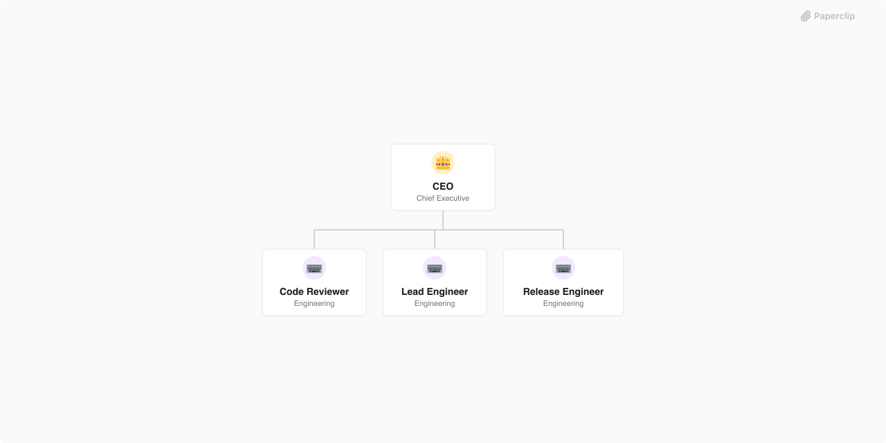

# Paperclip Companies

Pre-built agent companies and shared skills for [Paperclip](https://github.com/paperclipai/paperclip). Each company directory contains a complete company configuration ready to deploy, and the top-level `skills/` directory holds reusable skills that can be shared across companies.

| Company | Agents | Skills | Source |
|---------|--------|--------|--------|
| [GStack](#gstack) | 5 | 8 | [gstack](https://github.com/garrytan/gstack/tree/main) |
| [Superpowers Dev Shop](#superpowers-dev-shop) | 4 | 14 | [superpowers](https://github.com/obra/superpowers) |
| [Agency Agents](#agency-agents) | 167 | — | [agency-agents](https://github.com/msitarzewski/agency-agents) |
| [Aeon Intelligence](#aeon-intelligence) | 4 | 32 | [Aeon](https://github.com/aaronjmars/aeon) |
| [ClawTeam Capital](#clawteam-capital) | 7 | 1 | [ClawTeam](https://github.com/HKUDS/ClawTeam) |
| [ClawTeam Engineering](#clawteam-engineering) | 5 | 1 | [ClawTeam](https://github.com/HKUDS/ClawTeam) |
| [ClawTeam Research Lab](#clawteam-research-lab) | 4 | 1 | [ClawTeam](https://github.com/HKUDS/ClawTeam) |

## Companies

### [GStack](./gstack)

An engineering company built around Garry Tan's gstack workflow. Work flows through distinct cognitive modes: founder taste, technical planning, paranoid review, fast execution, and systematic QA. Built from [gstack](https://github.com/garrytan/gstack/tree/main).


**Agents (5):** Ceo, Cto, Qa Engineer, Release Engineer, Staff Engineer

**Skills (8):** browse, plan-ceo-review, plan-eng-review, qa, retro, review, setup-browser-cookies, ship

### [Superpowers Dev Shop](./superpowers)

A disciplined development company that enforces a rigorous pipeline workflow — brainstorming, planning, TDD implementation, code review, and verified shipping. Built from [superpowers](https://github.com/obra/superpowers).



**Agents (4):** Ceo, Code Reviewer, Lead Engineer, Release Engineer

**Skills (14):** brainstorming, dispatching-parallel-agents, executing-plans, finishing-a-development-branch, receiving-code-review, requesting-code-review, subagent-driven-development, systematic-debugging, test-driven-development, using-git-worktrees, using-superpowers, verification-before-completion, writing-plans, writing-skills

### [Agency Agents](./agency-agents)

A complete AI organization with 167 agents organized into 10 divisions — engineering, design, marketing, product, sales, QA, operations, game development, spatial computing, and specialized operations. Built from [agency-agents](https://github.com/msitarzewski/agency-agents).


**Agents (167):** Managing Director, VP Engineering, Creative Director, CMO, VP Product, VP Sales, QA Director, VP Operations, Game Dev Director, XR Director, Chief of Staff, and 156 more

### [Aeon Intelligence](./aeon-intelligence)

Autonomous AI intelligence company that runs research, engineering, crypto monitoring, and productivity workflows on GitHub Actions via Claude Code. Built from [Aeon](https://github.com/aaronjmars/aeon).


**Agents (4):** Cio, Crypto Analyst, Engineering Lead, Research Analyst

**Skills (32):** morning-brief, weekly-review, goal-tracker, digest, idea-capture, heartbeat, memory-flush, reflect, skill-health, self-review, article, research-brief, paper-digest, hacker-news-digest, rss-digest, reddit-digest, security-digest, tweet-digest, fetch-tweets, search-papers, pr-review, github-monitor, issue-triage, changelog, code-health, feature, build-skill, search-skill, token-alert, wallet-digest, on-chain-monitor, defi-monitor

### [ClawTeam Capital](./clawteam-capital)

AI-powered investment analysis firm that deploys specialized analyst teams to research securities from multiple angles and consolidate signals into risk-adjusted portfolio decisions. Built from [ClawTeam](https://github.com/HKUDS/ClawTeam).


**Agents (7):** Buffett Analyst, Fundamentals Analyst, Growth Analyst, Portfolio Manager, Risk Manager, Sentiment Analyst, Technical Analyst

**Skills (1):** clawteam

### [ClawTeam Engineering](./clawteam-engineering)

Agentic software engineering through self-organizing multi-agent teams that plan, build, review, test, and deploy software autonomously. Built from [ClawTeam](https://github.com/HKUDS/ClawTeam).


**Agents (5):** Backend Developer, Devops Engineer, Frontend Developer, Qa Engineer, Tech Lead

**Skills (1):** clawteam

### [ClawTeam Research Lab](./clawteam-research-lab)

Autonomous ML research automation through coordinated multi-agent teams that conduct literature surveys, design experiments, run analyses, and synthesize findings. Built from [ClawTeam](https://github.com/HKUDS/ClawTeam).


**Agents (4):** Data Analyst, Literature Surveyor, Methodology Designer, Principal Investigator

**Skills (1):** clawteam

### [Default](./default)

Baseline agent configurations (CEO, default roles) used as the starting point when creating new companies.

## Structure

Each company directory contains:

- `COMPANY.md` — company metadata, description, and goals
- `agents/` — agent configurations with role-specific prompts
- `skills/` — workflow skills available to agents
- `README.md` — detailed company documentation
- `.paperclip.yaml` — Paperclip configuration

The repo also includes top-level shared skills:

- `skills/company-creator` — scaffolds new agent company packages that follow the Agent Companies spec
- `.agents/skills/company-creator` — compatibility symlink for agents that discover skills from `.agents/skills`

## Shared Skills

### `company-creator`

Use `company-creator` when you want an agent to create a new company package from scratch, turn an existing repo into a company, or scaffold a team around an existing workflow.

Canonical path: `skills/company-creator/SKILL.md`

Compatibility path for agent skill discovery: `.agents/skills/company-creator`

## Usage

These companies are managed by the Paperclip platform. See the [Paperclip docs](https://github.com/paperclipai/paperclip) for setup and deployment.

To use the shared `company-creator` skill with an agent:

```text
Use the company-creator skill to create a new company for a product design team.
```

```text
Use the company-creator skill to turn this repo into a Paperclip company package.
```

The skill will interview you, scaffold the company package, and write the output where you choose.

To import a generated company into Paperclip:

```bash
paperclipai company import --from /path/to/company
```
