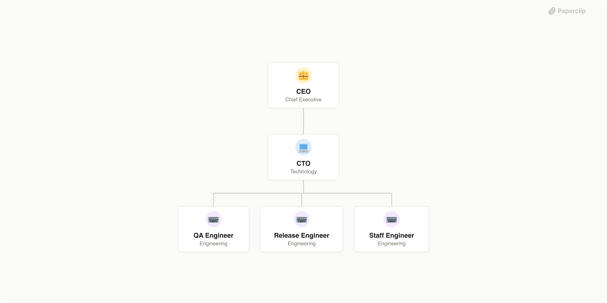

# GStack

> Engineering company powered by gstack workflow skills — distinct cognitive modes for product vision, technical planning, code review, shipping, and QA



## What's Inside

> This is an [Agent Company](https://agentcompanies.io) package from [Paperclip](https://paperclip.ing)

| Content | Count |
|---------|-------|
| Agents | 5 |
| Skills | 8 |

### Agents

| Agent | Role | Reports To |
|-------|------|------------|
| CEO | CEO | — |
| CTO | CTO | ceo |
| QA Engineer | Engineer | cto |
| Release Engineer | Engineer | cto |
| Staff Engineer | Engineer | cto |

### Skills

| Skill | Description | Source |
|-------|-------------|--------|
| browse | Fast headless browser for QA testing and site dogfooding. Navigate any URL, interact with elements, verify page state, take screenshots, check responsive layouts, test forms and uploads, handle dialogs, and assert element states. | [github](https://github.com/garrytan/gstack/blob/main/SKILL.md) |
| plan-ceo-review | CEO/founder-mode plan review. Rethink the problem, find the 10-star product, challenge premises, expand scope when it creates a better product. | [github](https://github.com/garrytan/gstack/blob/main/plan-ceo-review/SKILL.md) |
| plan-eng-review | Eng manager-mode plan review. Lock in the execution plan — architecture, data flow, diagrams, edge cases, test coverage, performance. | [github](https://github.com/garrytan/gstack/blob/main/plan-eng-review/SKILL.md) |
| qa | Systematically QA test a web application. Four modes: diff-aware (automatic on feature branches), full (systematic exploration), quick (30-second smoke test), regression (compare against baseline). Produces structured report with health score, screenshots, and repro steps. | [github](https://github.com/garrytan/gstack/blob/main/qa/SKILL.md) |
| retro | Weekly engineering retrospective. Analyzes commit history, work patterns, and code quality metrics with persistent history and trend tracking. Team-aware with per-person contributions, praise, and growth areas. | [github](https://github.com/garrytan/gstack/blob/main/retro/SKILL.md) |
| review | Pre-landing PR review. Analyzes diff against main for SQL safety, LLM trust boundary violations, conditional side effects, and other structural issues. | [github](https://github.com/garrytan/gstack/blob/main/review/SKILL.md) |
| setup-browser-cookies | Import cookies from your real browser (Comet, Chrome, Arc, Brave, Edge) into the headless browse session for testing authenticated pages. | [github](https://github.com/garrytan/gstack/blob/main/setup-browser-cookies/SKILL.md) |
| ship | Ship workflow: merge main, run tests, review diff, bump VERSION, update CHANGELOG, commit, push, create PR. | [github](https://github.com/garrytan/gstack/blob/main/ship/SKILL.md) |

## Getting Started

```bash
pnpm paperclipai company import this-github-url-or-folder
```

See [Paperclip](https://paperclip.ing) for more information.

---
Exported from [Paperclip](https://paperclip.ing) on 2026-03-23
