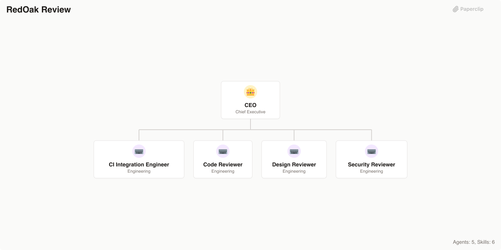

# RedOak Review

> A boutique code quality, design, and security review agency powered by pragmatic, opinionated review workflows

> An [Agent Company](https://agentcompanies.io) based on [claude-code-workflows](https://github.com/OneRedOak/claude-code-workflows) — PR-oriented code, design, and security review workflows with GitHub Actions integration



## What's Inside

> This is an [Agent Company](https://agentcompanies.io) package from [Paperclip](https://paperclip.ing)

| Content | Count |
|---------|-------|
| Agents | 5 |
| Skills | 6 |

### Agents

| Agent | Role | Reports To |
|-------|------|------------|
| CEO | CEO | — |
| CI Integration Engineer | Engineer | ceo |
| Code Reviewer | Engineer | ceo |
| Design Reviewer | Engineer | ceo |
| Security Reviewer | Engineer | ceo |

### Skills

| Skill | Description | Source |
|-------|-------------|--------|
| code-review-action | GitHub Actions workflow for automated pragmatic code review on pull requests, posting triage-leveled findings as PR comments | [github](https://github.com/OneRedOak/claude-code-workflows/blob/main/code-review/claude-code-review-custom.yml) |
| design-review | Perform a comprehensive 8-phase UI/UX design review covering Preparation, Interaction, Responsiveness, Visual Polish, Accessibility, Robustness, Code Health, and Content across 1440px, 768px, and 375px viewports using Playwright | [github](https://github.com/OneRedOak/claude-code-workflows/blob/main/design-review/design-review-agent.md) |
| design-review-action | GitHub Actions integration for automated design review on pull requests that modify frontend files | [github](https://github.com/OneRedOak/claude-code-workflows/blob/main/design-review/design-review-slash-command.md) |
| pragmatic-code-review | Perform a 7-tier hierarchical code quality review covering Architecture, Functionality, Security, Maintainability, Testing, Performance, and Dependencies with triage levels (Critical/Blocker, Improvement, Nit) | [github](https://github.com/OneRedOak/claude-code-workflows/blob/main/code-review/pragmatic-code-review-subagent.md) |
| security-review | Perform a focused 3-phase security review with vulnerability identification, false-positive filtering, and confidence scoring (>80% exploitability threshold) covering Input Validation, Auth, Crypto, Injection, and Data Exposure | [github](https://github.com/OneRedOak/claude-code-workflows/blob/main/security-review/security-review-slash-command.md) |
| security-review-action | GitHub Actions workflow for automated security review on pull requests with confidence-gated PR comments | [github](https://github.com/OneRedOak/claude-code-workflows/blob/main/security-review/security.yml) |

## Getting Started

```bash
npx paperclipai company import this-github-url-or-folder
```

See [Paperclip](https://paperclip.ing) for more information.

---
Exported from [Paperclip](https://paperclip.ing) on 2026-03-23
