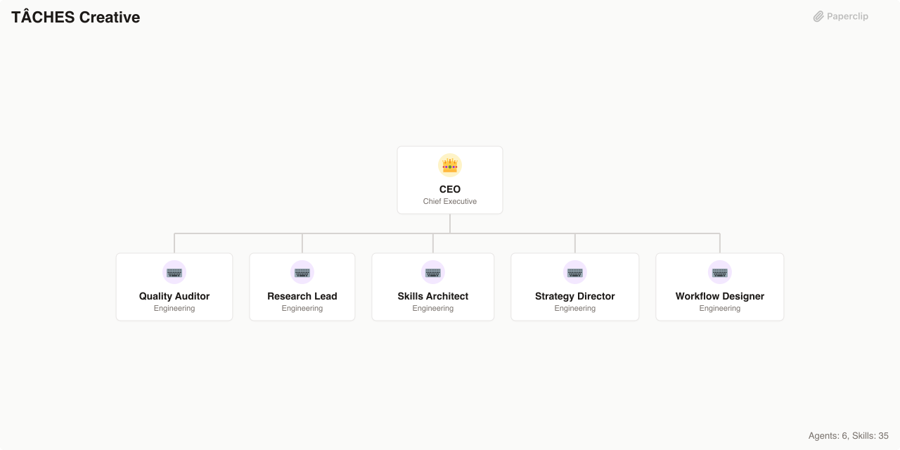

# TÂCHES Creative

> A creative strategy and meta-skills agency specializing in thinking frameworks, research methodology, and AI workflow optimization

> An [Agent Company](https://agentcompanies.io) based on [taches-cc-resources](https://github.com/glittercowboy/taches-cc-resources) — Claude Code commands and skills for planning, research methodology, MCP integration, and thinking frameworks



## What's Inside

> This is an [Agent Company](https://agentcompanies.io) package from [Paperclip](https://paperclip.ing)

| Content | Count |
|---------|-------|
| Agents | 6 |
| Skills | 35 |

### Agents

| Agent | Role | Reports To |
|-------|------|------------|
| CEO | CEO | — |
| Quality Auditor | Engineer | ceo |
| Research Lead | Engineer | ceo |
| Skills Architect | Engineer | ceo |
| Strategy Director | Engineer | ceo |
| Workflow Designer | Engineer | ceo |

### Skills

| Skill | Description | Source |
|-------|-------------|--------|
| consider-10-10-10 | Evaluate decisions across three time horizons: 10 minutes, 10 months, 10 years. Reveals when short-term thinking hijacks decisions and helps overcome present bias. | [github](https://github.com/glittercowboy/taches-cc-resources/blob/main/commands/consider/10-10-10.md) |
| consider-5-whys | Drill to root cause by asking why repeatedly. Moves past symptoms to actual cause, with actionable intervention at the root level. | [github](https://github.com/glittercowboy/taches-cc-resources/blob/main/commands/consider/5-whys.md) |
| consider-eisenhower-matrix | Apply the Eisenhower matrix (urgent/important) to prioritize tasks or decisions. Categorizes items into four quadrants: do first, schedule, delegate, eliminate. | [github](https://github.com/glittercowboy/taches-cc-resources/blob/main/commands/consider/eisenhower-matrix.md) |
| consider-first-principles | Break down to fundamentals and rebuild from base truths. Strips away assumptions, conventions, and analogies to identify irreducible truths, then rebuilds understanding. | [github](https://github.com/glittercowboy/taches-cc-resources/blob/main/commands/consider/first-principles.md) |
| consider-inversion | Solve problems backwards by asking what would guarantee failure, then avoid those things. Surfaces risks that optimistic planning misses. | [github](https://github.com/glittercowboy/taches-cc-resources/blob/main/commands/consider/inversion.md) |
| consider-occams-razor | Find the simplest explanation that fits all the facts. Enumerates assumptions, checks evidence, and selects the explanation with fewest unsupported assumptions. | [github](https://github.com/glittercowboy/taches-cc-resources/blob/main/commands/consider/occams-razor.md) |
| consider-one-thing | Identify the single highest-leverage action. Finds the one domino that knocks down all others, reducing overwhelm to a single focus with a concrete next step. | [github](https://github.com/glittercowboy/taches-cc-resources/blob/main/commands/consider/one-thing.md) |
| consider-opportunity-cost | Analyze what you give up by choosing this option. Makes hidden costs explicit by comparing against the best alternative use of the same resources. | [github](https://github.com/glittercowboy/taches-cc-resources/blob/main/commands/consider/opportunity-cost.md) |
| consider-pareto | Apply Pareto's principle (80/20 rule) to identify the vital few factors that drive the majority of results. Cuts through noise to focus on what actually matters. | [github](https://github.com/glittercowboy/taches-cc-resources/blob/main/commands/consider/pareto.md) |
| consider-second-order | Think through consequences of consequences. Traces causal chains beyond obvious first-order effects to reveal delayed costs, feedback loops, and unintended outcomes. | [github](https://github.com/glittercowboy/taches-cc-resources/blob/main/commands/consider/second-order.md) |
| consider-swot | Map strengths, weaknesses, opportunities, and threats. Combines internal and external factor analysis with cross-quadrant strategic moves (SO, WO, ST, WT strategies). | [github](https://github.com/glittercowboy/taches-cc-resources/blob/main/commands/consider/swot.md) |
| consider-via-negativa | Improve by removing rather than adding. Identifies genuine bloat versus essential elements, creating space and simplicity through subtraction. | [github](https://github.com/glittercowboy/taches-cc-resources/blob/main/commands/consider/via-negativa.md) |
| context-handoff | Create structured handoff documents to continue work in a fresh context without losing progress. Captures original task, work completed, work remaining, attempted approaches, critical context, and current state. | [github](https://github.com/glittercowboy/taches-cc-resources/blob/main/commands/whats-next.md) |
| create-agent-skills | Expert guidance for creating, writing, building, and refining Claude Code Skills. Covers SKILL.md authoring, router patterns, progressive disclosure, references, workflows, templates, and self-healing via heal-skill. | [github](https://github.com/glittercowboy/taches-cc-resources/blob/main/skills/create-agent-skills/SKILL.md) |
| create-hooks | Expert guidance for creating and configuring Claude Code hooks. Covers event-driven automation via PreToolUse, PostToolUse, Stop, SessionStart, and UserPromptSubmit events, with command and prompt hook types, matchers, and troubleshooting. | [github](https://github.com/glittercowboy/taches-cc-resources/blob/main/skills/create-hooks/SKILL.md) |
| create-mcp-servers | Create Model Context Protocol (MCP) servers that expose tools, resources, and prompts to Claude. Supports Python and TypeScript implementations with API research, OAuth handling, response optimization, and installation in Claude Code and Claude Desktop. | [github](https://github.com/glittercowboy/taches-cc-resources/blob/main/skills/create-mcp-servers/SKILL.md) |
| create-meta-prompts | Create optimized prompts for Claude-to-Claude pipelines with research, planning, and execution stages. Builds structured outputs with dependency detection for chaining research, plan, and implement workflows. | [github](https://github.com/glittercowboy/taches-cc-resources/blob/main/skills/create-meta-prompts/SKILL.md) |
| create-plans | Create hierarchical project plans optimized for solo agentic development. Produces Claude-executable plans with verification criteria -- briefs, roadmaps, phase plans, domain-aware task generation, context handoffs, and git versioning. | [github](https://github.com/glittercowboy/taches-cc-resources/blob/main/skills/create-plans/SKILL.md) |
| create-slash-commands | Expert guidance for creating Claude Code slash commands. Covers YAML frontmatter, arguments, dynamic context loading, tool restrictions, and command patterns. | [github](https://github.com/glittercowboy/taches-cc-resources/blob/main/skills/create-slash-commands/SKILL.md) |
| create-subagents | Expert guidance for creating Claude Code subagents and the Task tool. Covers agent configurations, system prompt writing, tool selection, model choice, orchestration patterns, and multi-agent workflows. | [github](https://github.com/glittercowboy/taches-cc-resources/blob/main/skills/create-subagents/SKILL.md) |
| debug-like-expert | Deep analysis debugging mode for complex issues. Activates methodical investigation with evidence gathering, hypothesis testing, and rigorous verification. For use when standard troubleshooting fails or issues require systematic root cause analysis. | [github](https://github.com/glittercowboy/taches-cc-resources/blob/main/skills/debug-like-expert/SKILL.md) |
| iphone-apps-expertise | Domain expertise for iPhone app development. Exhaustive knowledge base covering SwiftUI patterns, app architecture, navigation, networking, data persistence, testing, accessibility, App Store submission, and CLI workflows. | [github](https://github.com/glittercowboy/taches-cc-resources/blob/main/skills/expertise/iphone-apps/SKILL.md) |
| macos-apps-expertise | Domain expertise for macOS app development. Exhaustive knowledge base covering SwiftUI patterns, AppKit integration, document and shoebox app architectures, menu bar apps, system APIs, code signing, and CLI workflows. | [github](https://github.com/glittercowboy/taches-cc-resources/blob/main/skills/expertise/macos-apps/SKILL.md) |
| meta-prompting | Systematic approach to building complex software by delegating prompt engineering to Claude itself. Separates analysis from execution -- generates specification-grade prompts that run in fresh sub-agent contexts. | [github](https://github.com/glittercowboy/taches-cc-resources/blob/main/commands/create-prompt.md) |
| n8n-automations-expertise | Domain expertise for n8n workflow automation. Covers workflow architecture, node catalog, expressions, AI and HTTP nodes, code nodes, testing, performance optimization, and deployment. | [github](https://github.com/glittercowboy/taches-cc-resources/blob/main/skills/expertise/n8n-automations/SKILL-SPEC.yaml) |
| research-competitive | Research competitors -- who else does this, how they do it, strengths and weaknesses. Uses structured intake with clarifying questions and decision gates before execution. | [github](https://github.com/glittercowboy/taches-cc-resources/blob/main/commands/research/competitive.md) |
| research-deep-dive | Exhaustive deep-dive analysis of a single topic. Comprehensive research with intake gates, structured output, evidence quality ratings, and actionable recommendations. | [github](https://github.com/glittercowboy/taches-cc-resources/blob/main/commands/research/deep-dive.md) |
| research-feasibility | Assess whether something can be built, with what effort, and what risks or blockers exist. Evaluates technical, resource, and timeline feasibility. | [github](https://github.com/glittercowboy/taches-cc-resources/blob/main/commands/research/feasibility.md) |
| research-history | Research the history of a topic -- how it evolved, key milestones, and what patterns emerge over time. Provides chronological analysis with lessons learned. | [github](https://github.com/glittercowboy/taches-cc-resources/blob/main/commands/research/history.md) |
| research-landscape | Broad survey of a space -- players, trends, dynamics, and emerging patterns. Maps the territory before committing to a direction. | [github](https://github.com/glittercowboy/taches-cc-resources/blob/main/commands/research/landscape.md) |
| research-open-source | Find and evaluate open-source solutions, libraries, and tools. Compares options on activity, documentation, community, license, and fitness for purpose. | [github](https://github.com/glittercowboy/taches-cc-resources/blob/main/commands/research/open-source.md) |
| research-options | Compare specific alternatives with structured criteria. Side-by-side evaluation of options across dimensions that matter for the decision at hand. | [github](https://github.com/glittercowboy/taches-cc-resources/blob/main/commands/research/options.md) |
| research-technical | Deep technical analysis of architectures, APIs, or implementations. Evaluates technical approaches, tradeoffs, and produces actionable technical recommendations. | [github](https://github.com/glittercowboy/taches-cc-resources/blob/main/commands/research/technical.md) |
| setup-ralph | Set up Geoffrey Huntley's Ralph Wiggum autonomous coding loop. Configures iterative loops with task selection, execution, and validation -- fresh context every iteration prevents context poisoning. Three phases: planning, building, observation. | [github](https://github.com/glittercowboy/taches-cc-resources/blob/main/skills/setup-ralph/SKILL.md) |
| todo-management | Capture ideas mid-conversation without derailing current work. Add structured todo items with full context (file paths, line numbers, reasoning), then resume later with zero context loss via check-todos. | [github](https://github.com/glittercowboy/taches-cc-resources/blob/main/commands/add-to-todos.md) |

## Getting Started

```bash
npx paperclipai company import this-github-url-or-folder
```

See [Paperclip](https://paperclip.ing) for more information.

---
Exported from [Paperclip](https://paperclip.ing) on 2026-03-23
